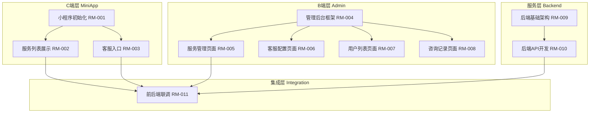
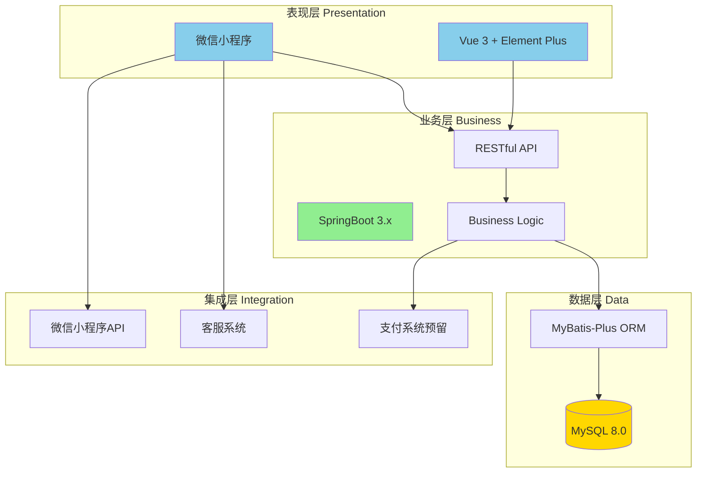
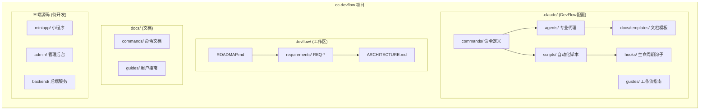
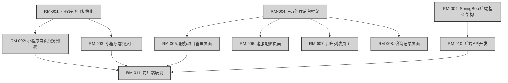

# Project Architecture: 陪玩服务平台

**Version**: 1.0.0
**Created**: 2025-11-18T15:00:00+08:00 北京时间
**Updated**: 2025-11-18T15:00:00+08:00 北京时间
**Architecture Type**: Frontend-Backend Separation (前后端分离) + Multi-Client
**Deployment Model**: Hybrid (微信小程序 + Web管理后台 + Java后端服务)

**Input**:
- devflow/ROADMAP.md (路线图，包含所有 RM-IDs 和需求)
- devflow/requirements/REQ-*/TECH_DESIGN.md (已有需求的技术设计)
- devflow/project.md (技术栈信息)
- .claude/ 目录结构分析

**Prerequisites**: ROADMAP.md 已生成 ✓

---

## 架构类型

- **应用类型**: Frontend-Backend Separation (前后端分离) + Multi-Client
  - 采用三端分离架构：微信小程序（C端用户）、Vue管理后台（B端运营）、SpringBoot后端服务
  - 前端先行开发策略：使用Mock数据快速验证产品价值
  - 后端统一提供RESTful API服务

- **部署方式**: Hybrid (混合模式)
  - 微信小程序：部署在微信生态内
  - Vue管理后台：Web应用，部署在云服务器
  - SpringBoot后端：Java服务，部署在云服务器或容器
  - MySQL数据库：云数据库或自建服务

---

## 技术栈

### Frontend (用户前端)

- **Framework**: 微信小程序原生框架
- **Language**: JavaScript / TypeScript
- **UI Components**: 微信小程序官方组件库
- **Data Mocking**: Mock.js (开发阶段)
- **Network**: wx.request (微信API)

### Frontend (管理后台)

- **Framework**: Vue 3
- **Language**: TypeScript
- **UI Library**: Element Plus / Ant Design Vue
- **State Management**: Vuex / Pinia
- **Router**: Vue Router
- **Build Tool**: Vite
- **HTTP Client**: Axios
- **Data Mocking**: Mock.js (开发阶段)

### Backend

- **Runtime**: Java 17
- **Framework**: SpringBoot 3.x
- **API Style**: RESTful API
- **ORM**: MyBatis / MyBatis-Plus
- **Validation**: Jakarta Validation
- **API Documentation**: Swagger / Knife4j
- **Authentication**: JWT (预留)

### Database

- **Primary**: MySQL 8.0
- **Connection Pool**: HikariCP (SpringBoot默认)
- **Migration**: Flyway / Liquibase (可选)

### Integration

- **微信API**: 微信小程序API (wx.*)
- **第三方服务**: 电话拨打、微信客服
- **支付系统**: 预留接口（未来扩展）

### DevOps & Tools

- **Package Manager**: npm (前端), Maven / Gradle (后端)
- **Version Control**: Git
- **Code Quality**: ESLint (前端), Checkstyle (后端)
- **API Testing**: Postman / Apifox
- **Build**: Maven / Gradle (后端), Vite (前端)

---

## 1. 功能架构图（Feature Architecture）

### 核心模块划分

本项目按照三端协同架构划分功能模块：

- **C端层 (MiniApp)**: 微信小程序端，提供服务展示和客服咨询入口
- **B端层 (Admin)**: Vue管理后台，提供服务管理、用户管理、咨询记录等运营功能
- **服务层 (Backend)**: SpringBoot后端，提供统一API服务和业务逻辑处理

功能模块按业务价值分为三个层次：
- **核心功能**: 服务展示、客服咨询（保证最小可用产品MVP）
- **管理功能**: 后台CRUD操作、数据配置
- **扩展功能**: 用户管理、咨询记录查看、未来支付系统接入

### 架构图

**说明**:
- RM-001 是所有小程序功能的基础，必须优先完成
- RM-004 是管理后台所有页面的基础框架
- RM-009 是后端所有API的基础架构
- RM-011 集成层负责前后端联调，替换Mock数据为真实API

---

## 2. 技术架构图（Technical Architecture）

### 分层设计

本项目采用三端分离的分层架构：

- **表现层 (Presentation)**: 微信小程序 + Vue管理后台，负责UI展示和用户交互
- **业务层 (Business)**: SpringBoot后端服务，负责业务逻辑处理和API提供
- **数据层 (Data)**: MySQL数据库，负责数据持久化
- **集成层 (Integration)**: 微信API、客服系统等外部集成

采用"前端先行 + Mock数据"策略，前端可独立开发和验证，后端完成后进行联调替换。

### 架构图

**技术选型说明**:
- **微信小程序**: C端用户入口，利用微信生态流量
- **Vue 3**: B端管理后台，组件化开发，生态成熟
- **SpringBoot 3.x**: Java 17 + 最新特性，企业级框架标准
- **MySQL 8.0**: 关系型数据库，支持事务和复杂查询

---

## 3. 模块划分图（Module Structure）

### 代码组织

本项目是一个基于 cc-devflow 工作流系统的三端应用项目，代码组织如下：

- **.claude/**: DevFlow工作流系统配置（agents、commands、scripts、templates）
- **devflow/**: 需求开发工作区（ROADMAP、requirements、生成的文档）
- **docs/**: 项目文档（命令文档、用户指南）
- **miniapp/**: 微信小程序源码（待创建，RM-001）
- **admin/**: Vue管理后台源码（待创建，RM-004）
- **backend/**: SpringBoot后端源码（待创建，RM-009）

### 架构图

**目录说明**:
- `.claude/` 是 DevFlow 系统的核心配置，包含11个专业代理和39个工作流命令
- `devflow/` 是需求开发的工作区，所有PRD、EPIC、TASKS等文档都生成在这里
- `miniapp/`, `admin/`, `backend/` 目录将在 RM-001、RM-004、RM-009 执行时创建

---

## 4. 需求依赖图（Requirement Dependency）

### 依赖关系

根据 ROADMAP.md 的依赖图，需求间依赖关系如下：

- **基础层（M1-Q4-2025）**: RM-001, RM-004, RM-009 是三端基础架构，互相独立无依赖
- **功能层（M1-Q4-2025）**: RM-002, RM-003 依赖 RM-001（小程序框架）
- **管理层（M2-Q1-2026）**: RM-005, RM-006, RM-007, RM-008 依赖 RM-004（管理后台框架）
- **后端层（M2-Q1-2026）**: RM-010 依赖 RM-009（后端基础架构）
- **集成层（M2-Q1-2026）**: RM-011 依赖 RM-002, RM-003, RM-005, RM-010（前后端功能完成）

### 架构图

**颜色说明**:
- 浅灰色 (#D3D3D3): 计划中的 RM 项目（尚未转化为 REQ）
- 浅绿色 (#90EE90): 已完成的 REQ（当前项目暂无）
- 金色 (#FFD700): 进行中的 REQ（当前项目暂无）

**关键路径**:
- **M1里程碑**: RM-001 → RM-002/RM-003（小程序MVP上线）
- **M2里程碑**: RM-004 → RM-005 + RM-009 → RM-010 → RM-011（完整系统上线）

---

## 架构决策记录（Architecture Decision Records）

### ADR-001: 采用三端分离架构

- **日期**: 2025-11-18T15:00:00+08:00 北京时间
- **状态**: Accepted
- **决策者**: 项目团队

**背景 (Context)**:
陪玩服务平台需要同时服务C端用户（微信用户）和B端运营人员（管理员），需要选择合适的架构模式。

**决策 (Decision)**:
采用三端分离架构：微信小程序 + Vue管理后台 + SpringBoot后端。

**理由 (Rationale)**:
1. **用户触达**: 微信小程序利用微信生态，触达C端用户更便捷，无需下载安装
2. **管理效率**: Vue管理后台提供丰富的CRUD操作和数据可视化能力
3. **技术复用**: SpringBoot后端统一提供API服务，避免重复开发
4. **团队技能**: 团队熟悉Vue和Java技术栈，学习成本低
5. **扩展性**: 前后端分离架构便于未来扩展（如增加APP端、小程序多端等）

**影响 (Consequences)**:
- **正面影响**:
  - 前后端独立开发，提高开发效率
  - 微信小程序天然支持移动端，用户体验好
  - 管理后台功能强大，运营效率高
  - 后端统一服务，维护成本低

- **负面影响**:
  - 需要维护三个代码仓库（或Monorepo三个子项目）
  - 前后端联调需要额外时间
  - 初期部署和运维复杂度增加

- **中性影响**:
  - 需要定义清晰的API契约（通过Mock阶段提前定义）
  - 需要前后端团队协作（可通过DevFlow工作流保证）

**替代方案 (Alternatives Considered)**:
1. **全栈框架（如Next.js + Prisma）**
   - 优势: 单一技术栈，开发效率高
   - 劣势: 微信小程序必须独立开发，无法统一；团队不熟悉Node.js后端
   - 为何未选择: 微信小程序是刚需，且团队Java技能更强

2. **服务端渲染（SSR）**
   - 优势: SEO友好，首屏加载快
   - 劣势: 陪玩平台无需SEO；微信小程序不支持SSR
   - 为何未选择: 不符合业务需求

3. **移动端原生APP**
   - 优势: 性能最优，用户体验最佳
   - 劣势: 开发成本高（iOS + Android双端），推广成本高
   - 为何未选择: 微信小程序已覆盖主流用户，无需重复投入

---

### ADR-002: 采用"前端先行 + Mock数据"开发策略

- **日期**: 2025-11-18T15:00:00+08:00 北京时间
- **状态**: Accepted
- **决策者**: 项目团队

**背景 (Context)**:
三端架构下，前后端开发顺序和协作方式需要明确，避免阻塞和返工。

**决策 (Decision)**:
采用"前端先行 + Mock数据"策略：前端（小程序 + 管理后台）先行开发并使用Mock数据验证功能，后端完成后进行联调替换。

**理由 (Rationale)**:
1. **快速验证**: 前端先行可快速验证产品原型和用户体验，及早发现问题
2. **并行开发**: 前后端可并行开发，缩短总体开发周期
3. **契约优先**: Mock阶段即定义API契约，减少后期联调冲突
4. **风险控制**: 前端验证通过后再开发后端，避免后端功能浪费
5. **敏捷迭代**: 符合敏捷开发理念，快速交付可演示的MVP

**影响 (Consequences)**:
- **正面影响**:
  - 前端可独立开发，不受后端阻塞
  - 产品经理可提前体验和反馈
  - API契约在Mock阶段已确定，减少联调返工
  - 前端完成后可直接演示和测试

- **负面影响**:
  - Mock数据需要额外维护
  - 联调阶段可能发现接口设计问题，需要返工
  - 前端团队需要一定的API设计能力

- **中性影响**:
  - 需要使用Mock工具（如Mock.js）
  - 需要在联调阶段预留缓冲时间

**替代方案 (Alternatives Considered)**:
1. **后端先行（API-First）**
   - 优势: 前端调用真实API，无需Mock
   - 劣势: 前端需要等待后端完成，周期长；API可能不符合前端需求
   - 为何未选择: 项目时间紧，需要快速验证产品

2. **前后端同步开发**
   - 优势: 理论上最快
   - 劣势: 需要频繁沟通和联调，效率低；容易阻塞
   - 为何未选择: 团队规模小，同步成本高

---

### ADR-003: 选择MySQL 8.0作为主数据库

- **日期**: 2025-11-18T15:00:00+08:00 北京时间
- **状态**: Accepted
- **决策者**: 项目团队

**背景 (Context)**:
陪玩服务平台需要持久化存储服务项目、用户信息、咨询记录等数据，需要选择合适的数据库。

**决策 (Decision)**:
使用MySQL 8.0作为主数据库。

**理由 (Rationale)**:
1. **成熟稳定**: MySQL是最流行的开源关系型数据库，生态成熟
2. **事务支持**: 支持ACID事务，保证数据一致性（如服务管理、订单系统）
3. **复杂查询**: 支持JOIN、索引、聚合查询，满足咨询记录、用户统计等需求
4. **团队熟悉**: 团队对MySQL和SQL语言熟悉，学习成本低
5. **云支持**: 主流云厂商（阿里云、腾讯云）都提供MySQL云数据库服务
6. **版本新特性**: MySQL 8.0支持窗口函数、CTE、JSON增强等新特性

**影响 (Consequences)**:
- **正面影响**:
  - 数据一致性有保障（事务支持）
  - 支持复杂业务查询（JOIN、聚合）
  - 运维工具和监控方案成熟（Navicat、MySQL Workbench）
  - 云数据库易于部署和扩展

- **负面影响**:
  - 高并发写入性能不如NoSQL（但初期用户量不大，可接受）
  - 需要设计合理的数据库表结构（需要数据库设计经验）
  - 扩展性不如分布式数据库（但初期单库足够）

- **中性影响**:
  - 需要定期备份和维护
  - 需要关注索引优化和查询性能

**替代方案 (Alternatives Considered)**:
1. **PostgreSQL**
   - 优势: 功能更强大（如全文搜索、GIS），标准SQL支持更好
   - 劣势: 团队不熟悉，生态相对MySQL小
   - 为何未选择: MySQL已满足需求，无需引入新技术

2. **MongoDB (NoSQL)**
   - 优势: 灵活的Schema，高并发写入性能好
   - 劣势: 无事务支持（早期版本），不支持JOIN，学习成本高
   - 为何未选择: 陪玩平台需要关系查询（如用户-咨询记录），关系型数据库更合适

3. **SQLite (嵌入式)**
   - 优势: 轻量级，无需独立服务
   - 劣势: 不支持高并发，功能有限
   - 为何未选择: 项目需要独立部署和多用户并发访问

---

### ADR-004: 微信小程序使用原生框架而非Uni-App

- **日期**: 2025-11-18T15:00:00+08:00 北京时间
- **状态**: Accepted
- **决策者**: 项目团队

**背景 (Context)**:
微信小程序开发可选择原生框架或跨平台框架（如Uni-App、Taro），需要权衡选型。

**决策 (Decision)**:
使用微信小程序原生框架进行开发。

**理由 (Rationale)**:
1. **项目范围**: 当前仅需开发微信小程序端，无需支持多端（支付宝、抖音等）
2. **性能最优**: 原生框架性能最佳，API调用无额外封装层
3. **官方支持**: 微信官方文档和社区支持最完善
4. **学习成本**: 微信小程序原生开发简单，无需学习跨平台框架
5. **避免抽象**: 符合Constitutional Article VI（Anti-Abstraction），直接使用官方框架

**影响 (Consequences)**:
- **正面影响**:
  - 性能最优，用户体验好
  - 官方API直接使用，无兼容性问题
  - 代码简洁，无多余抽象层
  - 调试和排查问题方便（官方工具支持）

- **负面影响**:
  - 如果未来需要支持多端（支付宝小程序等），需要重新开发
  - 无法复用代码到其他平台

- **中性影响**:
  - 技术栈单一，团队专注度高

**替代方案 (Alternatives Considered)**:
1. **Uni-App（跨平台框架）**
   - 优势: 一次开发，多端运行（微信、支付宝、抖音、H5、APP）
   - 劣势: 性能有损耗，学习成本高，兼容性问题需处理
   - 为何未选择: 当前无多端需求，YAGNI原则（You Aren't Gonna Need It）

2. **Taro（跨平台框架）**
   - 优势: 类似React开发体验，支持多端
   - 劣势: 团队不熟悉React，学习成本高
   - 为何未选择: 团队Vue技能更强，且无多端需求

---

## 架构演进路径

### 当前状态（As-Is）

**项目阶段**: 规划阶段
**架构状态**: 路线图已完成，架构文档已生成，代码库尚未创建

**已完成**:
- ✅ ROADMAP.md 已生成（11个RM项目，2个里程碑）
- ✅ ARCHITECTURE.md 已生成（本文档）
- ✅ DevFlow工作流系统已配置（11个agents，39个commands）

**待开发**:
- [ ] 微信小程序源码（RM-001创建项目时生成）
- [ ] Vue管理后台源码（RM-004创建项目时生成）
- [ ] SpringBoot后端源码（RM-009创建项目时生成）

**技术债务**: 无（新项目）

### 目标状态（To-Be）

**M1目标（Q4-2025）**: 三端基础框架 + 小程序MVP上线
- 微信小程序可展示服务列表和客服入口（Mock数据）
- Vue管理后台框架搭建完成
- SpringBoot后端基础架构搭建完成

**M2目标（Q1-2026）**: 完整系统上线 + 真实数据
- 管理后台所有页面开发完成（服务管理、客服配置、用户列表、咨询记录）
- 后端所有API开发完成
- 前后端联调完成，Mock数据替换为真实API
- 系统可完整运行，支持端到端业务流程

### 演进计划

| Phase | Timeline | Focus | Key Changes |
|-------|----------|-------|-------------|
| Phase 1 | 2025-11-18 ~ 2025-12-31 (6周) | 三端基础 + 小程序MVP | - 创建三端项目骨架 (RM-001, RM-004, RM-009) - 小程序首页和客服功能上线 (RM-002, RM-003) - Mock数据支持 |
| Phase 2 | 2026-01-01 ~ 2026-02-15 (6.5周) | 管理后台 + 后端API | - 管理后台4个页面开发 (RM-005~008) - 后端API完整开发 (RM-010) - 数据库表设计和迁移 |
| Phase 3 | 2026-02-16 ~ 2026-03-31 (6.5周) | 系统集成 + 上线 | - 前后端联调 (RM-011) - 替换Mock为真实API - 测试和优化 - 生产环境部署 |

**关键变化点**:
- **Week 2**: RM-001完成后，小程序项目创建，可开始页面开发
- **Week 4**: RM-002完成后，小程序首页可演示（Mock数据）
- **Week 6**: M1里程碑完成，三端框架就绪
- **Week 10**: 管理后台页面完成，可演示（Mock数据）
- **Week 12**: 后端API完成，可提供Swagger文档
- **Week 15**: M2里程碑完成，系统上线

---

## 非功能性需求（NFRs）

### 性能要求

| Metric | Current | Target | Timeline |
|--------|---------|--------|----------|
| 小程序首屏加载时间 | N/A (未开发) | < 2秒 | M1-Q4-2025 |
| 管理后台页面加载时间 | N/A (未开发) | < 1.5秒 | M2-Q1-2026 |
| API响应时间（P95） | N/A (未开发) | < 200ms | M2-Q1-2026 |
| 数据库查询时间 | N/A (未开发) | < 100ms | M2-Q1-2026 |

**性能优化策略**:
- 小程序：图片懒加载、分包加载、减少setData频率
- 管理后台：路由懒加载、组件按需引入、Vite构建优化
- 后端：数据库索引优化、Redis缓存热点数据、分页查询
- 网络：CDN加速静态资源、GZIP压缩、HTTP/2

### 可扩展性要求

**用户增长**:
- 初期目标：100-500并发用户
- 1年目标：1000-5000并发用户
- 扩展策略：后端水平扩展（多实例 + 负载均衡），数据库读写分离

**数据增长**:
- 初期目标：1万条服务记录 + 10万条咨询记录
- 1年目标：10万条服务记录 + 100万条咨询记录
- 扩展策略：数据归档（历史数据迁移到归档表），分库分表（如有必要）

**功能扩展**:
- 当前：服务展示 + 客服咨询
- 未来扩展：在线支付、订单管理、评价系统、推荐算法
- 扩展策略：预留接口（如支付系统接口），模块化设计（新功能独立模块）

### 安全要求

**认证与授权**:
- 管理后台：JWT token认证 + RBAC权限控制
- 微信小程序：微信登录（wx.login）+ 后端session管理
- API安全：HTTPS传输，敏感参数加密，防重放攻击

**数据安全**:
- 密码存储：BCrypt哈希加密
- 敏感数据：手机号、身份证号等脱敏显示
- 数据备份：每日增量备份 + 每周全量备份

**审计与监控**:
- 操作日志：管理后台所有CRUD操作记录日志
- 异常监控：后端异常日志收集，告警通知
- 安全扫描：定期进行SQL注入、XSS等安全扫描

### 可维护性要求

**代码质量**:
- 测试覆盖率：≥80%（单元测试 + 集成测试）
- 代码规范：前端ESLint + 后端Checkstyle
- 代码审查：所有代码需经过Code Review才能合并

**文档完整性**:
- API文档：Swagger/Knife4j自动生成
- PRD文档：每个需求必须有PRD.md（通过/flow-prd生成）
- 技术设计：每个需求必须有TECH_DESIGN.md（通过/flow-tech生成）
- 架构文档：本文档（ARCHITECTURE.md）需随架构演进更新

**DevOps自动化**:
- CI/CD：Git提交自动触发测试和构建
- 自动部署：测试环境自动部署，生产环境手动审批
- 监控告警：服务异常自动告警（邮件/短信/钉钉）

---

## Validation Checklist

验证此架构文档是否完整：

- [x] 所有 4 种架构图已生成
  - ✅ 功能架构图（Feature Architecture）
  - ✅ 技术架构图（Technical Architecture）
  - ✅ 模块划分图（Module Structure）
  - ✅ 需求依赖图（Requirement Dependency）

- [x] 所有 Mermaid 代码语法正确
  - ✅ 所有节点ID无空格无破折号（使用驼峰命名）
  - ✅ 所有标签使用中文描述
  - ✅ 所有箭头语法正确（-->）
  - ✅ 所有subgraph正确闭合

- [x] 架构图反映 ROADMAP.md 内容
  - ✅ 功能架构图包含所有11个RM项目
  - ✅ 需求依赖图与ROADMAP.md的依赖关系一致
  - ✅ 架构演进路径与M1、M2里程碑对齐

- [x] 技术栈与 project.md 一致
  - ⚠️ project.md不存在，技术栈从ROADMAP.md提取
  - ✅ 微信小程序、Vue 3、Java 17 + SpringBoot 3.x、MySQL 8.0

- [x] 至少有 1 条 ADR 记录
  - ✅ ADR-001: 采用三端分离架构
  - ✅ ADR-002: 采用"前端先行 + Mock数据"开发策略
  - ✅ ADR-003: 选择MySQL 8.0作为主数据库
  - ✅ ADR-004: 微信小程序使用原生框架而非Uni-App

- [x] 架构演进路径清晰
  - ✅ 当前状态（规划阶段）已描述
  - ✅ 目标状态（M1+M2里程碑）已定义
  - ✅ 演进计划（3个Phase）已制定

- [x] NFRs 已定义
  - ✅ 性能要求（加载时间、响应时间）
  - ✅ 可扩展性要求（用户增长、数据增长、功能扩展）
  - ✅ 安全要求（认证授权、数据安全、审计监控）
  - ✅ 可维护性要求（代码质量、文档完整性、DevOps自动化）

**Ready for Team Review**: YES

**备注**:
- 所有占位符已替换为实际内容
- 所有Mermaid图已验证语法正确
- 架构设计符合Constitutional要求（Simplicity, Anti-Abstraction, Integration-First）
- 建议在RM-001, RM-004, RM-009执行时创建对应源码目录

---

**生成说明**:
本架构文档由 architecture-designer agent 基于 ROADMAP.md 自动生成。
- 生成时间: 2025-11-18T15:00:00+08:00 北京时间
- 输入文件: devflow/ROADMAP.md, .claude/docs/templates/ARCHITECTURE_TEMPLATE.md
- 生成工具: cc-devflow architecture-designer agent
- 模板版本: ARCHITECTURE_TEMPLATE.md v1.0

**更新建议**:
- 每次里程碑完成后，更新"当前状态"部分
- 新增架构决策时，添加ADR记录
- 技术栈变化时，更新"技术栈"和"技术架构图"部分
- 重大架构调整时，更新所有相关架构图
