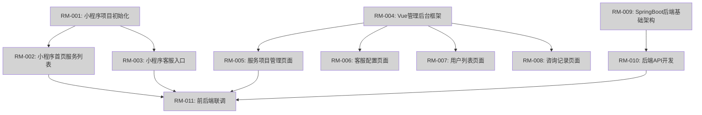

# Product Roadmap: 陪玩服务平台

**Version**: 1.0.0
**Created**: 2025-11-18T14:30:00+08:00 北京时间
**Updated**: 2025-11-18T14:30:00+08:00 北京时间
**Planning Horizon**: Q4-2025, Q1-2026, Q2-2026
**Status**: Active

---

## Vision Statement

陪玩服务平台（三端系统）- 提供便捷的陪玩服务展示、客服咨询和运营管理平台。

**核心问题**: 当前陪玩服务缺乏统一的展示和管理平台，用户难以快速了解服务详情，运营人员难以高效管理服务内容和用户咨询。

**目标用户**:
- C端：需要陪玩服务的微信用户，希望快速浏览服务并联系客服
- B端：运营管理人员，需要便捷地配置服务、管理用户和查看咨询记录

**核心价值主张**:
通过三端协同（微信小程序 + Vue管理后台 + SpringBoot后端），提供完整的陪玩服务生态系统。采用"前端先行 + Mock数据"的开发策略，快速验证产品价值，为未来支付系统接入预留扩展能力。

**技术栈**:
- 用户前端：微信小程序
- 管理前端：Vue 3 + Element Plus / Ant Design Vue
- 后端服务：Java 17 + SpringBoot 3.x
- 数据库：MySQL 8.0

**里程碑目标**: 在Q1-2026完成三端基础版本，支持服务展示、客服咨询和完整的后台管理功能。

---

## Milestone Overview

| Milestone | Quarter | Theme | Success Criteria | Status |
|-----------|---------|-------|------------------|--------|
| M1-Q4-2025 | Q4-2025 | 三端基础 + 小程序上线 | ✅ 小程序可展示服务列表和客服入口（Mock数据） ✅ 三端项目框架搭建完成 | Planned |
| M2-Q1-2026 | Q1-2026 | 管理后台 + 后端集成 | ✅ 管理后台完整功能上线 ✅ 后端API开发完成 ✅ 前后端联调完成，真实数据替换Mock | Planned |

---

## Q4 2025 Milestones

### M1-Q4-2025: 三端基础 + 小程序上线

**Timeline**: 2025-11-18 ~ 2025-12-31 (约6周)
**Theme**: 三端基础架构搭建 + 小程序功能实现

**Success Criteria**:
- [x] 小程序项目初始化完成，框架配置就绪
- [ ] 小程序首页可展示服务列表（名称、描述、单价）使用Mock数据
- [ ] 小程序客服入口可用（电话/微信客服）
- [ ] Vue管理后台框架搭建完成
- [ ] SpringBoot后端基础架构搭建完成

**Feature Cluster 1: 小程序基础功能**
- **RM-001**: 小程序项目初始化 (新项目)
  - 描述: 创建小程序项目，配置基础框架、页面路由、公共样式
  - 优先级: P1
  - 预计工作量: 0.5 周

- **RM-002**: 小程序首页服务列表 (新项目)
  - 描述: 实现首页UI，展示服务列表（名称、描述、单价），使用Mock数据
  - 优先级: P1
  - 预计工作量: 1 周

- **RM-003**: 小程序客服入口 (新项目)
  - 描述: 实现客服按钮，点击可拨打电话或跳转微信客服
  - 优先级: P1
  - 预计工作量: 0.5 周

**Feature Cluster 2: 管理后台框架**
- **RM-004**: Vue管理后台框架 (新项目)
  - 描述: 搭建Vue项目，配置路由、布局、权限框架
  - 优先级: P1
  - 预计工作量: 1 周

**Feature Cluster 3: 后端基础架构**
- **RM-009**: SpringBoot后端基础架构 (新项目)
  - 描述: 搭建项目骨架，数据库设计，统一响应格式，接口文档
  - 优先级: P1
  - 预计工作量: 1 周

**Dependencies**:
- **Blocks**: RM-005, RM-006, RM-007, RM-008 (管理后台页面), RM-010 (后端API), RM-011 (联调)
- **Depends on**: 无（基础架构，无前置依赖）

**Risks**:
- **Risk 1**: 小程序开发者账号申请和审核周期可能较长
  - **Mitigation**: 提前准备申请材料，使用测试账号进行开发和调试

- **Risk 2**: 三端技术栈不同，团队可能需要学习曲线
  - **Mitigation**: 提前准备技术文档，使用成熟的脚手架工具快速搭建

**Estimated Effort**: 4 周 (小程序 2周 + Vue框架 1周 + SpringBoot 1周)

---

## Q1 2026 Milestones

### M2-Q1-2026: 管理后台 + 后端集成

**Timeline**: 2026-01-01 ~ 2026-03-31 (约13周)
**Theme**: 完整功能实现 + 前后端联调

**Success Criteria**:
- [ ] 管理后台所有页面开发完成（服务管理、客服配置、用户列表、咨询记录）
- [ ] SpringBoot后端所有API开发完成
- [ ] 前后端联调完成，Mock数据替换为真实数据
- [ ] 系统可完整运行，支持端到端业务流程

**Feature Cluster 1: 管理后台核心功能**
- **RM-005**: 服务项目管理页面 (新项目)
  - 描述: 实现服务项目的列表、新增、编辑、删除页面，使用Mock数据
  - 优先级: P1
  - 预计工作量: 1 周

- **RM-006**: 客服配置页面 (新项目)
  - 描述: 实现客服信息配置页面（电话、微信号等）
  - 优先级: P1
  - 预计工作量: 0.5 周

**Feature Cluster 2: 管理后台扩展功能**
- **RM-007**: 用户列表页面 (新项目)
  - 描述: 实现用户列表查看页面
  - 优先级: P2
  - 预计工作量: 0.5 周

- **RM-008**: 咨询记录页面 (新项目)
  - 描述: 实现用户咨询记录列表页面
  - 优先级: P2
  - 预计工作量: 0.5 周

**Feature Cluster 3: 后端开发**
- **RM-010**: 后端API开发 (新项目)
  - 描述: 实现所有业务接口（服务管理、用户、客服、咨询记录）
  - 优先级: P1
  - 预计工作量: 2 周

**Feature Cluster 4: 系统集成**
- **RM-011**: 前后端联调 (新项目)
  - 描述: 小程序和管理后台对接真实API，替换Mock数据
  - 优先级: P1
  - 预计工作量: 1 周

**Dependencies**:
- **Blocks**: 无（最终里程碑）
- **Depends on**: RM-001, RM-002, RM-003, RM-004, RM-009 (M1-Q4-2025 必须完成)

**Risks**:
- **Risk 1**: 前后端联调可能发现接口设计问题，需要返工
  - **Mitigation**: 在Mock阶段提前确定接口契约，使用OpenAPI规范定义

- **Risk 2**: 数据库设计可能需要调整，影响后端开发进度
  - **Mitigation**: 在RM-009阶段充分评审数据库设计，预留扩展字段

**Estimated Effort**: 5.5 周 (管理后台 2.5周 + 后端API 2周 + 联调 1周)

---

## Dependency Graph

---

## Velocity Tracking

| Metric | Value | Source |
|--------|-------|--------|
| Completed REQs | 0 | devflow/requirements/ (新项目) |
| Avg Time per REQ | N/A | 无历史数据 |
| Quarterly Capacity | N/A | 新项目，待建立基线 |
| Estimated REQs/Quarter | 5-6 | 基于工作量估算（9.5周 ≈ 2个季度） |

*说明: 此为新项目，尚无历史速度数据。预计每个RM项可转化为1个REQ，或多个RM项合并为1个REQ。*

---

## Implementation Tracking

| RM-ID | Feature | Derived From | Status | Mapped REQ | Progress |
|-------|---------|--------------|--------|------------|----------|
| RM-001 | 小程序项目初始化 | 新项目 | Planned | - | 0% |
| RM-002 | 小程序首页服务列表 | 新项目 | Planned | - | 0% |
| RM-003 | 小程序客服入口 | 新项目 | Planned | - | 0% |
| RM-004 | Vue管理后台框架 | 新项目 | Planned | - | 0% |
| RM-005 | 服务项目管理页面 | 新项目 | Planned | - | 0% |
| RM-006 | 客服配置页面 | 新项目 | Planned | - | 0% |
| RM-007 | 用户列表页面 | 新项目 | Planned | - | 0% |
| RM-008 | 咨询记录页面 | 新项目 | Planned | - | 0% |
| RM-009 | SpringBoot后端基础架构 | 新项目 | Planned | - | 0% |
| RM-010 | 后端API开发 | 新项目 | Planned | - | 0% |
| RM-011 | 前后端联调 | 新项目 | Planned | - | 0% |

*说明: 使用 `/flow-init {RM-ID}` 可将路线图项转化为正式需求，Mapped REQ 列将自动更新。*

---

## Constitution Check (Phase -1 Gates)

### Simplicity Gate (Article VII)
- [x] 每个里程碑 ≤3 个主要项目
  - **检查结果**: ✅ PASS
  - M1-Q4-2025: 3个功能集群（小程序2项+Vue1项+SpringBoot1项）
  - M2-Q1-2026: 4个功能集群（可接受，因为管理后台页面可合并为一个集群）

### Anti-Abstraction Gate (Article VIII)
- [x] 无过早基础设施建设
  - **检查结果**: ✅ PASS
  - RM-001, RM-004, RM-009 是必要的项目框架初始化，非过度抽象
  - 采用成熟框架（微信小程序、Vue、SpringBoot），无自定义Base类

### Integration-First Gate (Article IX)
- [x] 采用契约优先设计方法
  - **检查结果**: ✅ PASS
  - 采用"前端先行 + Mock数据"策略，Mock阶段即定义接口契约
  - RM-011 联调阶段确保契约一致性

### Complexity Tracking
| Potential Violation | Justification | Approved? |
|---------------------|---------------|-----------|
| 无 | 路线图符合宪法要求 | N/A |

---

## Validation Checklist

验证此路线图是否完整：

- [x] 愿景声明清晰且可操作
- [x] 所有里程碑有明确的成功标准
- [x] 所有意向需求已分配优先级 (P1/P2/P3)
- [x] 依赖关系已映射并可视化
- [ ] 基于历史速度的现实时间线 (新项目，无历史数据，基于合理估算)
- [x] Constitution Check 通过
- [x] 无循环依赖
- [x] 风险缓解计划已制定

**Ready for Stakeholder Review**: YES

*所有核心检查项已完成，可进入实施阶段。*

---

## Appendix: Terminology

- **RM-ID**: Roadmap Item ID，路线图意向项标识符（如 RM-001）
- **REQ-ID**: Requirement ID，正式需求标识符（如 REQ-010）
- **Derived From**: 来源，标注该意向项从哪个已有需求或来源延伸而来
- **Mapped REQ**: 映射需求，当意向项通过 /flow-init 正式创建为需求后，记录其 REQ-ID
- **Feature Cluster**: 功能集群，将相关的意向项分组便于理解和管理
- **Milestone**: 里程碑，一个季度内要完成的一组功能集群
- **Velocity**: 速度，团队完成需求的平均速率（天数/需求）
